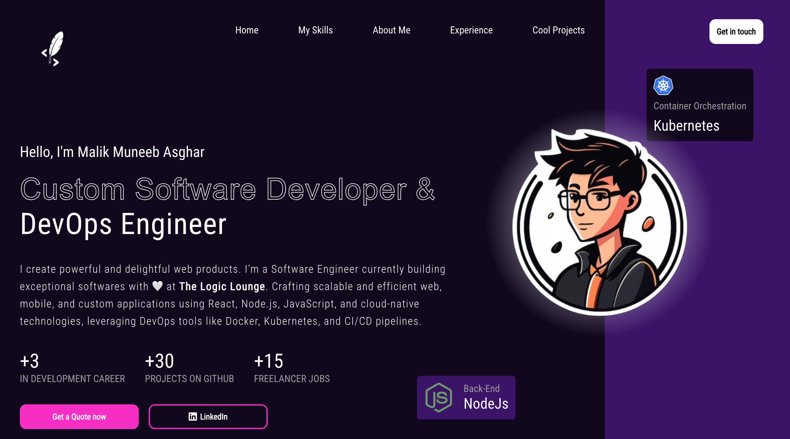

# My DevOps Portfolio

### Portfolio FullStack Software Engineer

⚛ Development with ReactJS - Portfolio

#### 📑 Explanation
This project focuses on front-end skills with ReactJS, development of my personal portfolio, and web system development. It follows best practices using ReactJS Hooks, component rendering, and demonstrates some of my skills and projects.

🚀 Project:



⚔️ Tools used in Front-end Development / ReactJS:

- **Create React App**:  
  Initialize the project using:
```bash
  npx create-react-app
```

- **React Icons:Install icons for your project:**
```bash
npm install react-icons
```

- **React Elastic Carousel, For carousel functionality:**
```bash
npm install react-elastic-carousel
```

-**ESLint:
Code linting and style standardization:**

```bash
npx eslint --init
```
💻 Prerequisites Before you begin, make sure you've met the following requirements:

You have the latest version of Node.js installed.
You are running the project on a Windows machine (or any compatible environment).

**🚀 Installing the project To install the project, follow these steps:**

For Windows or other OS:

```bash
git clone <repository_url>
cd <repository_folder>
npm install
npm start
```
**📫 Contributing to the Project To contribute to this project, follow these steps:**

Fork this repository.
Create a branch:
```bash
git checkout -b <branch_name>
```
Make your changes and commit them:
```bash
git commit -m '<commit_message>'
```

Push to the original branch:
```bash
git push origin <branch_name>
```
Create a pull request.

Alternatively, see the GitHub documentation on how to create a pull request.

🤝 Collaborators Thanks to the following people who have contributed to this project:

Malik Muneeb Asghar
😄 Want to contribute? Do you want to be part of this project? Click HERE to read how to contribute.

📝 License This project is licensed. See the LICENSE file for more details.

**Feel free to modify or add additional details, like your project link under the "Live Application Deploy" section, and customize it further as needed!**


